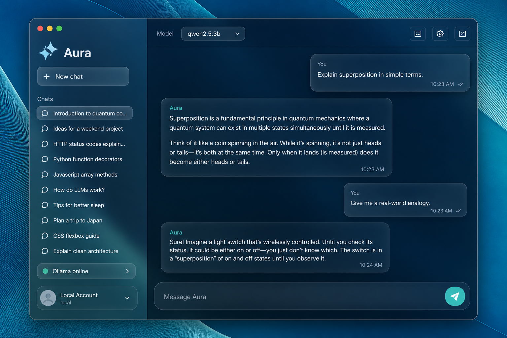

# Aura

**Private AI chat that lives on your machine — glass UI, local models, zero cloud.**

Aura is a consumer-grade desktop client for [Ollama](https://ollama.com). It streams replies from models you run locally, keeps every conversation on disk under your account, and never phones home.

<p align="center">
  
</p>

---

## Why Aura?

| Benefit | What you get |
|---|---|
| **Truly local** | Talks only to `localhost:11434`. No API keys. No telemetry. |
| **Apple Glass UI** | Frosted panels, mesh light, springy motion — built for focus. |
| **Your accounts, your history** | Local sign-in isolates chat threads per user on this device. |
| **Streaming that feels alive** | Token-by-token replies with Stop, markdown, and code highlighting. |
| **Docker-ready Ollama** | One compose file to stand up models — then open Aura. |

---

## Quick start (5 minutes)

### 1. Prerequisites

- **Node.js 20+**
- **Ollama** — either [install natively](https://ollama.com/download) **or** use Docker (below)
- **Git**

### 2. Clone & install

```bash
git clone https://github.com/JamesKevinJones/glass-chat.git
cd glass-chat
npm install
```

### 3. Start Ollama + pull a model

**Option A — Native Ollama**

```bash
ollama serve
ollama pull qwen2.5:3b
```

**Option B — Docker Compose (recommended for clean setups)**

```bash
docker compose up -d
docker compose exec ollama ollama pull qwen2.5:3b
```

Ollama is now reachable at **http://localhost:11434**.

Optional browser companion (Open WebUI):

```bash
docker compose --profile webui up -d
# open http://localhost:8080
```

### 4. Launch Aura

```bash
npm run dev
```

1. Create a **local account** (username + password — stored only on this PC)  
2. Pick a model from the dropdown  
3. Chat. Your history saves automatically under that account.

---

## Everyday commands

| Command | What it does |
|---|---|
| `npm run dev` | Electron + Vite development app |
| `npm run build` | Typecheck, Vite production build, Electron compile |
| `npm test` | Vitest unit/UI smoke tests |
| `npm run typecheck` | Strict TypeScript across renderer + main |
| `docker compose up -d` | Start Ollama in Docker |
| `docker compose down` | Stop Ollama containers |

Helper scripts:

```bash
# Windows PowerShell
./scripts/pull-model.ps1

# macOS / Linux
chmod +x ./scripts/pull-model.sh && ./scripts/pull-model.sh
```

---

## Local accounts & chat history

Aura uses **device-local profiles**:

- Passwords are **scrypt-hashed** in the Electron main process (never exposed to the renderer).
- Sessions and chat threads live under your OS app data folder:
  - `…/aura/accounts.json`
  - `…/aura/session.json`
  - `…/aura/users/<id>/threads.json`
- Signing out clears the in-memory session; signing back in restores **that user’s** history.
- Switching accounts never mixes threads.

> Tip: Create one account for work and one for experiments — each keeps its own timeline.

---

## Architecture (at a glance)

```
┌─────────────────────┐     HTTP localhost       ┌──────────────────┐
│  Aura (Electron)    │ ───────────────────────► │  Ollama :11434   │
│  React + Zustand    │                          │  qwen / llama…   │
│  Secure preload IPC │                          └──────────────────┘
└──────────┬──────────┘
           │ IPC (contextBridge)
           ▼
┌─────────────────────┐
│  Main process       │
│  Auth + JSON store  │
└─────────────────────┘
```

Aura talks to Ollama over plain **HTTP** at `http://localhost:11434` (never HTTPS).

- **Renderer:** UI only — glass layout, streaming markdown, model picker  
- **Preload:** typed `window.aura` bridge (`login`, `register`, `loadThreads`, …)  
- **Main:** scrypt auth, atomic JSON persistence, CSP hardening  

---

## Suggested models

| Model | Good for | Pull |
|---|---|---|
| `qwen2.5:3b` | Fast everyday chat on modest machines | `ollama pull qwen2.5:3b` |
| `llama3.2` | Balanced general assistant | `ollama pull llama3.2` |
| `mistral` | Strong writing / reasoning | `ollama pull mistral` |
| `codellama` | Code help | `ollama pull codellama` |

GPU tip: with Docker + NVIDIA Container Toolkit, uncomment the GPU block in `docker-compose.yml`.

---

## Troubleshooting

| Symptom | Fix |
|---|---|
| **Connection Error** screen | Ensure Ollama is up: `ollama serve` or `docker compose up -d` |
| **No models found** | `ollama pull qwen2.5:3b` then retry in Aura |
| Blank Electron window in dev | CSP must allow Vite’s React preamble — already configured in `index.html` |
| Port 11434 busy | Stop other Ollama instances or change Docker port mapping |
| Forgot password | Local-only — create a new account (data is per-user on disk) |

---

## Project scripts & stack

**Stack:** Electron · React 19 · Vite · TypeScript · Tailwind CSS · Framer Motion · Zustand · Lucide  

**Security posture:** `contextIsolation`, sandboxed renderer, no Node in the UI, invoke-only IPC, production CSP headers.

---

## Contributing

Issues and PRs welcome. Keep changes focused — Aura stays local-first by design.

```bash
npm run typecheck && npm test && npm run build
```

---

## License

Private / as published by the repository owner. Add an open-source license file if you intend to redistribute.

---

<p align="center">
  <strong>Aura</strong> — intelligence with glass walls, not glass ceilings.
</p>
